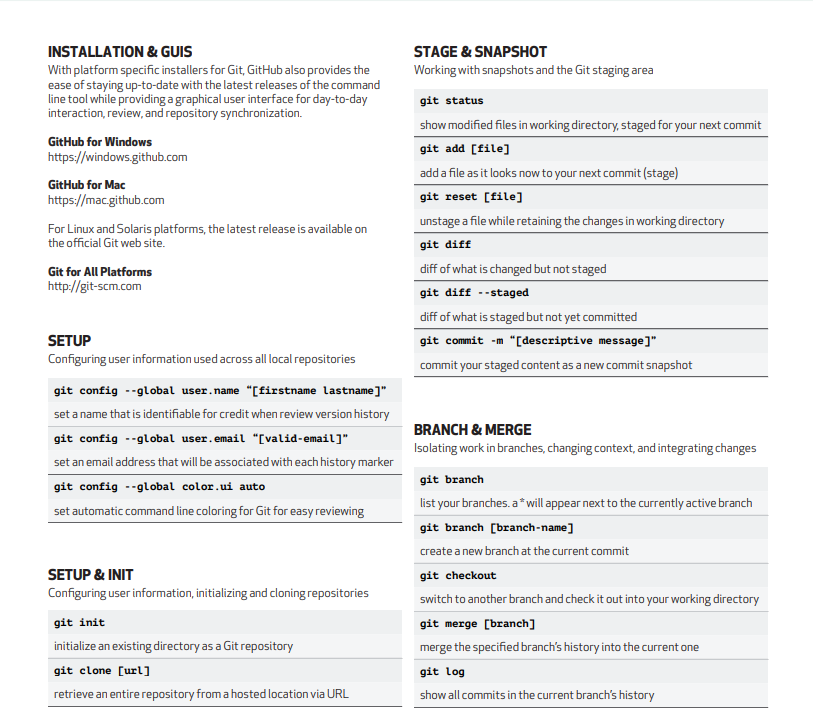
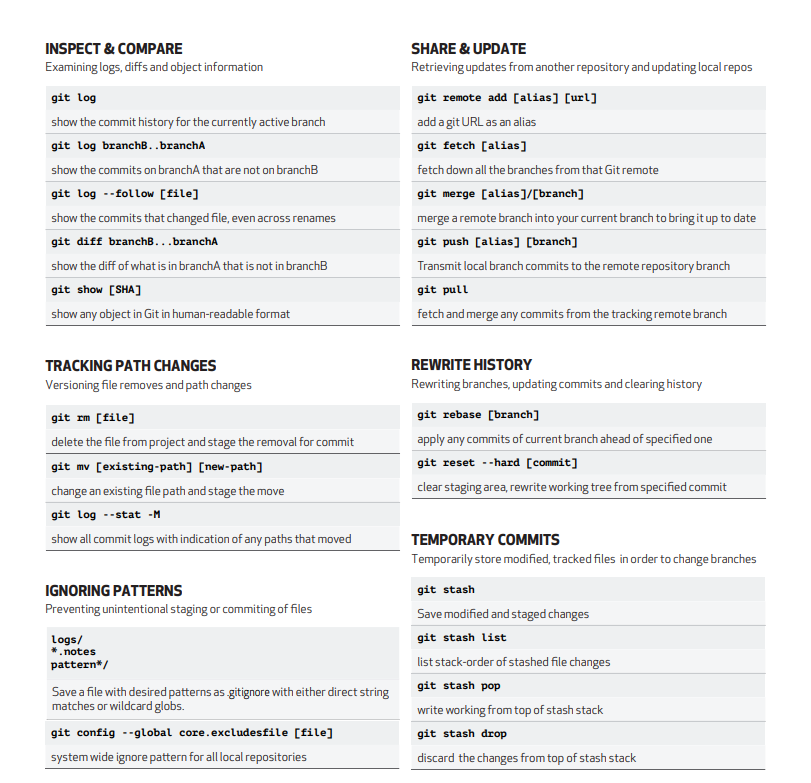
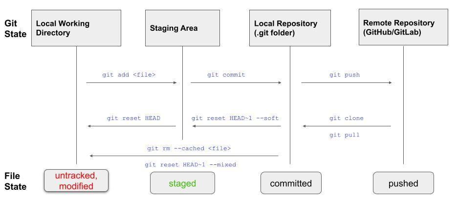

# Git 
### General
Version control is useful for anyone that creates content, Keeps track of any changes and allows restoring of older versions.
Allows easier collaboration between users and teams as well as working on multiple branches of a project without causing conflicts.
Works locally or can push to a setup server or cloud service such as GitHub.
### Cheatsheets

### Branches
Git branches facilitate separate lines of development within a repository,the initial branch(usually called main or master) and then any spun off branches can be pushed to and retain their own version history.
separate branches can then be merged and any conflicts or issues from combining files can be delt with then, reducing time lost developing due to conflicts.
### How Git functions
Git functions by storing snapshots of files and their data when prompted by the user executing commands. These snapshots are sorted into repositories that enables developers to restore a file to a previous snapshotted state. The states a file can be in are:
1. Untracked: Files that have not been added to a Git workflow.
2. Modified: Files who's data has changed from the last commit but the changes are not yet tracked for the next commit, if left in this state the file will remain outside of Gits record.
3. Staged: Files that have been included into the next commit.
4. Committed: Here files have been saved into a Git repository permanently storing their state along with a commit message used to describe changes.
